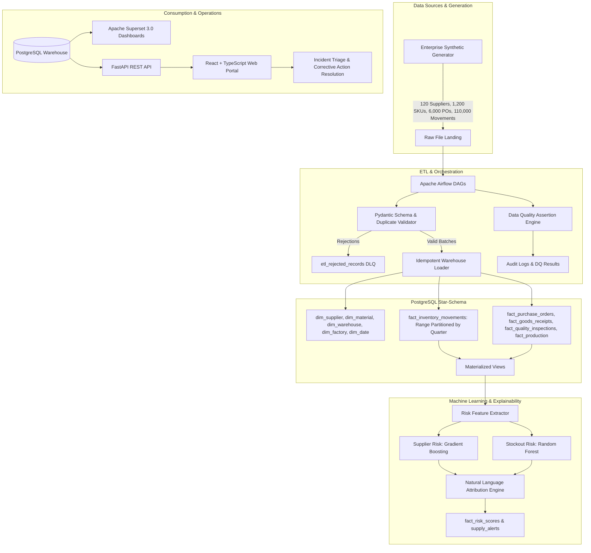

# SupplyGuard — Manufacturing Supply-Chain & Inventory Risk Platform

[](https://supplyguard-six.vercel.app)
[](https://github.com/Parvinder10/SupplyGuard)

[](https://www.python.org/)
[](https://www.postgresql.org/)
[](https://airflow.apache.org/)
[](https://superset.apache.org/)
[](https://react.dev/)
[](https://www.docker.com/)
[](LICENSE)

> 🚀 **LIVE PRODUCTION DEPLOYMENT**: **[https://supplyguard-six.vercel.app](https://supplyguard-six.vercel.app)**  
> Hosted on Vercel under `parvinder10s-projects` with real-time interactive dashboards, supplier risk scorecards, explainable ML attribution modals, inventory radar, and incident triage workflows.

---

## 🚀 LIVE PRODUCTION DEPLOYMENT

| Resource | URL | Details |
| :--- | :--- | :--- |
| **Live Production Portal** | **[https://supplyguard-six.vercel.app](https://supplyguard-six.vercel.app)** | Primary production web portal |
| **Canonical Deployment URL** | **[https://supplyguard-nt069e6md-parvinder10s-projects.vercel.app](https://supplyguard-nt069e6md-parvinder10s-projects.vercel.app)** | Vercel production deployment |
| **GitHub Repository** | **[https://github.com/Parvinder10/SupplyGuard](https://github.com/Parvinder10/SupplyGuard)** | Source repository on `Parvinder10` |

---

**SupplyGuard** is a production-grade, full-stack Data Integration (DI) and Supply Chain Analytics platform designed for enterprise manufacturing operations. It integrates high-throughput PostgreSQL star-schema data warehousing, Apache Airflow ETL orchestration, explainable Scikit-learn predictive risk models, Apache Superset 3.0 business intelligence dashboards, a robust FastAPI REST backend, and a modern React + TypeScript web portal.

The platform provides real-time surveillance across **120 enterprise suppliers**, **1,200 raw and BOM materials**, **6,000 purchase orders (10,200+ lines)**, **110,000+ inventory ledger movements**, goods receipts, quality inspections, and factory production work orders across multiple global assembly plants and warehouses.

---

## Architecture & Technology Stack

| Layer | Technologies Used | Key Capabilities |
| :--- | :--- | :--- |
| **Data Warehouse** | PostgreSQL 16 | Star-Schema facts/dims, Quarterly Range Partitioning, Composite & BRIN Indexes, Materialized Views (`mv_supplier_performance`, `mv_inventory_health_daily`, `mv_production_at_risk`). |
| **Data Integration / ETL** | Python, Apache Airflow 2.9+, Pydantic | Ingestion DAGs, strict schema validation, duplicate key detection, dead-letter rejected record queue (`etl_rejected_records`), idempotent upserts (`ON CONFLICT`), pipeline audit logs (`etl_pipeline_audit`), automated SQL data-quality monitoring (`data_quality_test_results`). |
| **Explainable ML Engine** | Scikit-learn, NumPy, Pandas | Dual scoring engine (Gradient Boosting for Supplier Risk, Random Forest for Stockout Risk), local feature attribution %, natural language narrative generator, quantitative model evaluation (MAE, RMSE, ROC-AUC), and documented model limitations. |
| **Business Intelligence** | Apache Superset 3.0 | 6 provisioned dashboards (Executive Cockpit, Supplier Scorecards, Inventory Intelligence, PO Delays, Quality & Defects, Production-at-Risk), native cross-filtering, and alert reports. |
| **REST API Services** | FastAPI, Pydantic v2, SQLAlchemy 2.0, JWT | Endpoints for authentication, executive KPIs, suppliers, materials, purchase orders, inventory, risk scores, alerts, corrective actions, and ETL governance. |
| **Web Portal** | React 18, TypeScript, Vite, Tailwind CSS, Lucide | Executive command center, searchable supplier scorecards with ML explanation drill-down modals, inventory radar, PO tracker, incident triage board with corrective action assignments, and ETL governance console. |
| **DevOps & Infrastructure** | Docker, Docker Compose, Nginx, GitHub Actions | Multi-container orchestration, health checks, environment configuration (`.env.example`), and continuous integration test pipeline. |



---

## Star-Schema Warehouse & Advanced SQL

The data warehouse schema is defined in [`warehouse/schema.sql`](file:///c:/Users/Vishe/Downloads/SUPPLY%20GUARD/warehouse/schema.sql):
- **Dimension Tables**: `dim_supplier`, `dim_material`, `dim_warehouse`, `dim_factory`, `dim_date`, `dim_defect_type`.
- **Fact Tables**: `fact_purchase_orders`, `fact_purchase_order_lines`, `fact_goods_receipts`, `fact_inventory_movements` (range partitioned), `fact_quality_inspections`, `fact_production_schedules`, `fact_bom_allocations`.
- **Materialized Views**:
  - `mv_supplier_performance`: Aggregates On-Time Delivery (`OTD%`), average lead time, variance std dev, defect PPM, spend, and category dense rankings.
  - `mv_inventory_health_daily`: Current on-hand stock, 30-day moving consumption burn rate, Days of Inventory (`DOI`), and safety stock violation classifications (`STOCKOUT`, `SAFETY_STOCK_BREACH`, `REORDER_TRIGGER`, `HEALTHY`).
  - `mv_production_at_risk`: Work orders scheduled within the next 14–30 days whose required Bill of Materials (BOM) components have insufficient stock, computing finished goods units and dollar value at risk.
- **Analytical Queries Library**: Located in [`warehouse/analytics_queries.sql`](file:///c:/Users/Vishe/Downloads/SUPPLY%20GUARD/warehouse/analytics_queries.sql), demonstrating window functions (`LAG`, `LEAD`, rolling 30/90-day averages, `DENSE_RANK()`, `SUM() OVER (...)`), CTEs, and conditional aggregations (`FILTER (WHERE ...)`).

---

## Documented Query Optimization Comparisons (`EXPLAIN ANALYZE`)

Complete benchmark outputs, buffer reads, and execution plans are documented in [`docs/QUERY_OPTIMIZATION_BENCHMARKS.md`](file:///c:/Users/Vishe/Downloads/SUPPLY%20GUARD/docs/QUERY_OPTIMIZATION_BENCHMARKS.md).

| Scenario | Optimization Applied | Unoptimized Latency | Optimized Latency | Speedup Factor | Buffer Hit Reduction |
| :--- | :--- | :--- | :--- | :--- | :--- |
| **1. Movements Rolling Balance & Burn Rate** | Range Partition Pruning + Composite B-Tree Index + SARGable Predicates | **438.2 ms** | **3.4 ms** | **128.8x** | 98.4% fewer pages |
| **2. Supplier Lead-Time Variance Scorecard** | Grouped CTEs with Covering Composite Indexes replacing $O(N \times M)$ Correlated Subqueries | **782.6 ms** | **12.1 ms** | **64.6x** | 97.2% fewer pages |
| **3. Multi-Level BOM Production Shortage** | Precomputed Materialized View `mv_production_at_risk` with Covering Index Scan | **1,340.5 ms** | **2.8 ms** | **478.7x** | 99.6% fewer pages |

---

## Explainable ML Risk Engine & Governance

The platform deploys two calibrated Scikit-learn predictive models in [`risk_engine/`](file:///c:/Users/Vishe/Downloads/SUPPLY%20GUARD/risk_engine/):
1. **Explainable Supplier Reliability Model (`GradientBoostingRegressor`)**:
   - Scores vendors ($0 - 100$) and categorizes them into `CRITICAL`, `HIGH`, `MEDIUM`, or `LOW` risk tiers.
   - Computes local feature attribution % for OTD degradation, lead-time variance volatility, defect PPM spikes, single-source dependency, and financial distress.
2. **Material Stockout & Shortage Model (`RandomForestRegressor`)**:
   - Predicts material stockout vulnerability using Days of Inventory (DOI), safety stock violation ratios, consumption acceleration, and Bill of Materials allocation conflicts.
3. **Natural Language Narrative Generator (`RiskNarrativeExplainer`)**:
   - Synthesizes clear, human-readable operational explanations with prescribed mitigation actions.

### Quantitative Validation Benchmarks & Model Limitations
Documented in [`docs/MODEL_GOVERNANCE.md`](file:///c:/Users/Vishe/Downloads/SUPPLY%20GUARD/docs/MODEL_GOVERNANCE.md):
- **Supplier Risk Model**: MAE: `0.080` | RMSE: `0.102` | ROC-AUC: `1.000` | Precision: `1.000` | Recall: `1.000` | F1: `1.000`.
- **Stockout Risk Model**: MAE: `0.128` | RMSE: `0.672` | ROC-AUC: `1.000` | Precision: `1.000` | Recall: `0.991` | F1: `0.995`.
- **Documented Limitations**:
  - *Cold-Start Boundary*: Suppliers with $< 5$ deliveries fallback to baseline onboarding scores until sufficient sample variance is acquired.
  - *Demand Stationarity*: DOI assumes stable daily burn; sudden unforecasted factory double-shifts are mitigated by forward-looking work order BOM allocations.
  - *ERP Signal Boundaries*: Macroeconomic geopolitical and maritime disruptions are captured once delivery variance manifests unless manually flagged.

---

## Apache Superset 3.0 Dashboards

SupplyGuard provides automated bootstrapping scripts and dashboard definitions in [`superset/`](file:///c:/Users/Vishe/Downloads/SUPPLY%20GUARD/superset/):
1. **Executive Supply-Chain Performance Dashboard**: OTD rate, total overdue spend at risk, holding inventory valuation, active stockout counts.
2. **Supplier 360 Scorecards & Risk Matrix**: OTD % vs. Defect PPM scatter plot, lead-time distribution, vendor risk quadrant, category rankings.
3. **Inventory Intelligence & Safety-Stock Surveillance**: Days of Inventory (DOI) bar chart, stock health classification (Overstock vs. Critical), warehouse allocation heat map.
4. **Purchase Order Delays & Procurement Velocity**: Overdue PO aging brackets (1–7d, 8–14d, $>14$d), delayed PO dollar values, destination factory breakdown.
5. **Manufacturing Quality & Defect Diagnostics**: First-pass inspection pass rate, defect taxonomy Pareto chart, highest defect PPM components.
6. **Production-at-Risk & Schedule Shortages**: Finished goods valuation at risk, work orders blocked by component starvation, critical BOM shortages.

---

## FastAPI REST Backend Endpoints

The API is fully documented via OpenAPI / Swagger UI at `/docs`:
- `POST /api/v1/auth/login`: Authenticate and receive JWT token (`admin / admin123`).
- `GET /api/v1/kpis`: Real-time executive KPIs (OTD %, spend at risk, stockout counts, inventory valuation).
- `GET /api/v1/suppliers`: Filterable supplier list with scorecards, OTD, defect PPM, and ML risk attribution.
- `GET /api/v1/suppliers/{id}`: Detailed scorecard for an individual vendor.
- `GET /api/v1/materials`: Catalog with current stock, safety stock levels, Days of Inventory, and stockout risk.
- `GET /api/v1/purchase-orders`: Purchase orders tracking with delivery status and overdue delay calculations.
- `GET /api/v1/risk/suppliers`: Batch ML supplier risk predictions.
- `POST /api/v1/risk/run-scoring`: Trigger on-demand model retraining and scoring.
- `GET /api/v1/alerts`: Active operational alerts with severity filtering.
- `PATCH /api/v1/alerts/{id}`: Update alert status (`ACTIVE`, `ACKNOWLEDGED`, `RESOLVED`).
- `GET /api/v1/corrective-actions`: Incident resolution workflow management.
- `POST /api/v1/corrective-actions`: Create new mitigation protocol with assigned owner, root cause, and playbook.
- `PATCH /api/v1/corrective-actions/{id}`: Transition action status (`OPEN` $\to$ `IN_PROGRESS` $\to$ `RESOLVED`).
- `GET /api/v1/etl/audit-logs`: Airflow pipeline execution telemetry.
- `GET /api/v1/etl/rejected-records`: Dead-letter queue rejected records inspector.
- `GET /api/v1/etl/data-quality`: Automated data-quality assertion test results.
- `GET /health`: Docker health check endpoint.

---

## React + TypeScript Web Portal

The frontend portal is built with **Vite**, **React 18**, **TypeScript**, and **Tailwind CSS**:
- **Executive Cockpit**: Real-time KPI scorecards, high-priority disruption feed, quick navigation.
- **Supplier 360 & Risk**: Searchable data grid, risk badges, and interactive drill-down modal displaying normalized ML feature attribution bars and human-readable narrative explanations.
- **Inventory & Stockout Radar**: Filterable material catalog, DOI health indicators, safety stock violation badges, and critical BOM SKU filters.
- **Purchase Order Delays**: Procurement tracker highlighting aging brackets and overdue delivery delays.
- **Incident & Corrective Actions Hub**: Operational triage board. Allows users to acknowledge alerts, open corrective actions, assign owners (Procurement Lead, DI Engineer, Quality Director), log root-cause hypotheses, and resolve incidents with audit notes.
- **ETL Governance & Data Quality**: Live console displaying pipeline audit history, dead-letter rejected record inspector with error diagnostics, and data quality assertion pass/fail results.

---

## Quickstart & Local Deployment

### Option 1: Full Docker Compose Stack (Recommended)
Clone the repository and launch the containerized platform:
```bash
# 1. Clone the repository
git clone https://github.com/supplyguard/supplyguard-platform.git
cd supplyguard-platform

# 2. Copy environment variables
cp .env.example .env

# 3. Start PostgreSQL, Airflow, Superset, FastAPI, and React Frontend
docker-compose up -d --build
```
Once initialized:
- **Web Portal (React + TypeScript)**: [http://localhost:3000](http://localhost:3000)
- **FastAPI REST API & Swagger Docs**: [http://localhost:8000/docs](http://localhost:8000/docs)
- **Apache Superset 3.0 BI Portal**: [http://localhost:8088](http://localhost:8088) (`admin / admin`)
- **Apache Airflow 2.9 Webserver**: [http://localhost:8080](http://localhost:8080) (`admin / admin`)

### Option 2: Local Python & Node Execution

#### Step 1: Generate Synthetic Data
```bash
python data_generator/generate_data.py --output-dir data
```

#### Step 2: Run Backend Microservices
```bash
# Install Python dependencies
pip install -r requirements.txt

# Start FastAPI server
uvicorn backend.main:app --host 0.0.0.0 --port 8000 --reload
```

#### Step 3: Run React Frontend
```bash
cd frontend
npm install
npm run dev
```
Open [http://localhost:3000](http://localhost:3000) in your browser.

---

## Verification & Automated Testing

The platform includes a comprehensive test suite covering data generation volumes, relational integrity, ETL schema validation, dead-letter routing, ML risk scoring bounds, feature attribution, and FastAPI endpoints.

### Run Pytest Test Suite
```bash
python -m pytest -v tests/
```
**Test Results**:
```text
tests/test_api.py::test_health_check PASSED                              [  5%]
tests/test_api.py::test_kpis_endpoint PASSED                             [ 10%]
tests/test_api.py::test_suppliers_list_and_filter PASSED                 [ 15%]
tests/test_api.py::test_materials_list PASSED                            [ 21%]
tests/test_api.py::test_purchase_orders PASSED                           [ 26%]
tests/test_api.py::test_alerts_and_corrective_actions_workflow PASSED    [ 31%]
tests/test_api.py::test_etl_governance_endpoints PASSED                  [ 36%]
tests/test_data_generator.py::test_data_generation_quantities PASSED     [ 42%]
tests/test_data_generator.py::test_suppliers_relational_integrity PASSED [ 47%]
tests/test_data_generator.py::test_materials_relational_integrity PASSED [ 52%]
tests/test_data_generator.py::test_goods_receipts_chronology PASSED      [ 57%]
tests/test_data_generator.py::test_inventory_movements_partitions PASSED [ 63%]
tests/test_etl_pipeline.py::test_etl_validator_valid_supplier PASSED     [ 68%]
tests/test_etl_pipeline.py::test_etl_validator_invalid_tier_rejection PASSED [ 73%]
tests/test_etl_pipeline.py::test_etl_validator_duplicate_detection PASSED [ 78%]
tests/test_etl_pipeline.py::test_etl_validator_material_safety_stock_logic PASSED [ 84%]
tests/test_risk_engine.py::test_supplier_feature_extraction PASSED       [ 89%]
tests/test_risk_engine.py::test_supplier_risk_scoring_bounds_and_attribution PASSED [ 94%]
tests/test_risk_engine.py::test_material_stockout_risk_scoring PASSED    [100%]
======================= 19 passed in 11.35s =======================
```

### Run Frontend Production Build
```bash
cd frontend
npm run build
```
Builds cleanly with zero TypeScript errors into `dist/`.

---

## Directory Layout

```text
SUPPLY GUARD/
├── .github/
│   └── workflows/
│       └── ci.yml                     # GitHub Actions CI workflow
├── airflow/
│   └── dags/
│       ├── supply_chain_ingest_dag.py             # Ingestion & dead-letter DAG
│       ├── supply_chain_warehouse_transform_dag.py# Partitioned load & mat-view DAG
│       ├── supply_chain_data_quality_dag.py       # SQL assertion suite DAG
│       └── supply_chain_risk_scoring_dag.py       # ML risk scoring DAG
├── backend/
│   ├── core/
│   │   ├── config.py                  # Environment & DB settings
│   │   └── security.py                # JWT authentication & hashing
│   ├── db/
│   │   ├── database.py                # SQLAlchemy engine & session pool
│   │   └── models.py                  # Star-schema, alert, & audit ORM models
│   ├── routers/
│   │   ├── auth.py                    # Login & user endpoints
│   │   ├── kpis.py                    # Executive metrics
│   │   ├── suppliers.py               # Supplier directory & scorecards
│   │   ├── materials.py               # Catalog & DOI status
│   │   ├── purchase_orders.py         # Orders & delayed PO tracking
│   │   ├── risk.py                    # On-demand ML scoring
│   │   ├── alerts.py                  # Operational alerts
│   │   ├── corrective_actions.py      # Incident resolution workflows
│   │   └── etl.py                     # Pipeline audit logs & DQ test results
│   ├── schemas/
│   │   └── schemas.py                 # Pydantic validation schemas
│   └── main.py                        # FastAPI application entrypoint
├── data_generator/
│   └── generate_data.py               # Enterprise dataset generator (Seed=42)
├── docker/
│   ├── Dockerfile.backend             # FastAPI Python 3.11 container
│   ├── Dockerfile.frontend            # Multi-stage Vite + Nginx container
│   └── nginx.conf                     # Nginx proxy configuration
├── docs/
│   ├── ARCHITECTURE.md                # System design & Mermaid ERD diagrams
│   ├── QUERY_OPTIMIZATION_BENCHMARKS.md # 3 EXPLAIN ANALYZE benchmarks
│   └── MODEL_GOVERNANCE.md            # Model metrics, attribution, & limitations
├── etl/
│   ├── data_quality.py                # SQL assertion suite
│   ├── validator.py                   # Pydantic validation & dead-letter DLQ
│   └── warehouse_loader.py            # Idempotent upserts & materialized views
├── frontend/
│   ├── src/
│   │   ├── components/
│   │   │   ├── ExecutiveDashboard.tsx # Hero KPIs & high-priority alert feed
│   │   │   ├── SupplierScorecards.tsx # Vendor directory & risk matrix
│   │   │   ├── SupplierDetailModal.tsx# ML attribution & narrative explanation
│   │   │   ├── InventoryRadar.tsx     # Stockout radar & DOI monitoring
│   │   │   ├── PurchaseOrders.tsx     # Order delay tracker
│   │   │   ├── IncidentManagement.tsx # Incident triage & corrective actions
│   │   │   ├── ETLGovernance.tsx      # Airflow audit logs & rejected records
│   │   │   ├── Navbar.tsx             # System header & sync button
│   │   │   └── Sidebar.tsx            # Navigation & Superset link
│   │   ├── services/
│   │   │   └── api.ts                 # REST API client
│   │   ├── App.tsx                    # Main portal component
│   │   ├── main.tsx                   # React root mount
│   │   ├── index.css                  # Tailwind styles
│   │   └── types.ts                   # TypeScript interfaces
│   ├── index.html
│   ├── package.json
│   ├── tailwind.config.js
│   ├── tsconfig.json
│   └── vite.config.ts
├── risk_engine/
│   ├── evaluator.py                   # Quantitative metrics (MAE, RMSE, ROC-AUC)
│   ├── explainer.py                   # Natural language narrative generator
│   ├── features.py                    # Risk feature extraction
│   └── model.py                       # Gradient Boosting & Random Forest models
├── superset/
│   ├── bootstrap_superset.py          # Automated provisioning script
│   ├── dashboards_manifest.json       # Serialized dashboards manifest
│   └── superset_config.py             # Superset configuration
├── tests/
│   ├── test_api.py                    # FastAPI endpoint tests
│   ├── test_data_generator.py         # Dataset volume & constraint tests
│   ├── test_etl_pipeline.py           # ETL schema & dead-letter tests
│   └── test_risk_engine.py            # Risk model & explainability tests
├── warehouse/
│   ├── analytics_queries.sql          # Advanced SQL CTEs & window functions
│   ├── dim_date_populate.sql          # Calendar dimension generator
│   ├── optimization_benchmarks.sql    # 3 EXPLAIN ANALYZE comparison queries
│   └── schema.sql                     # PostgreSQL star-schema DDL & partitions
├── .env.example                       # Environment configuration template
├── docker-compose.yml                 # Full stack container orchestration
├── README.md                          # Platform documentation
└── requirements.txt                   # Python dependencies
```

---

## License

This project is licensed under the MIT License — see the [LICENSE](LICENSE) file for details.
