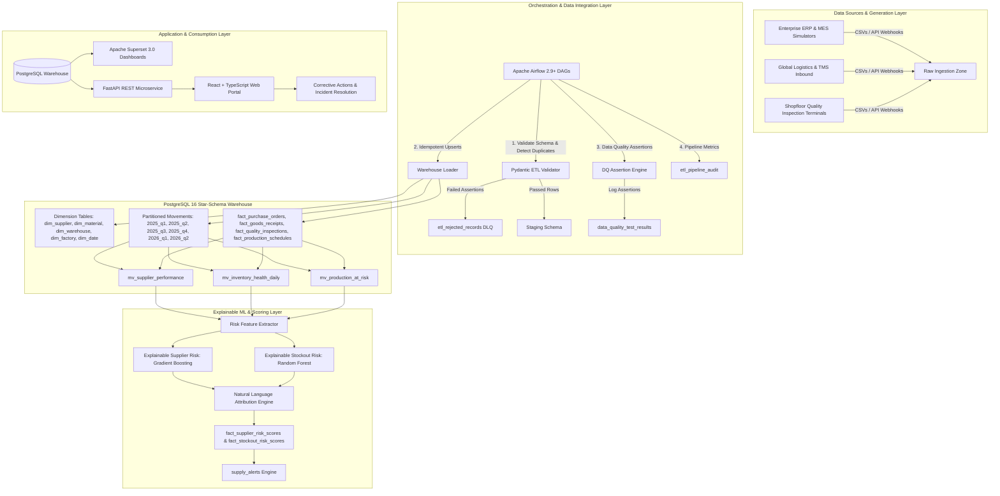
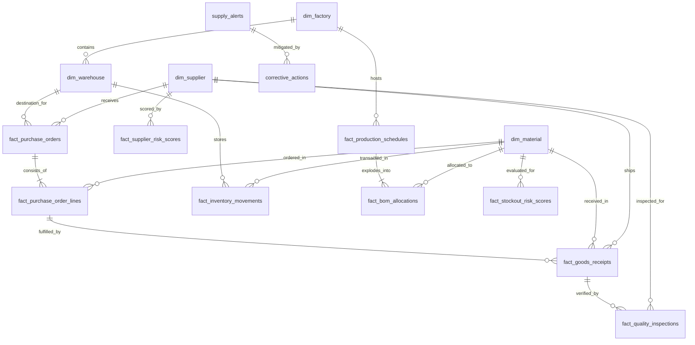
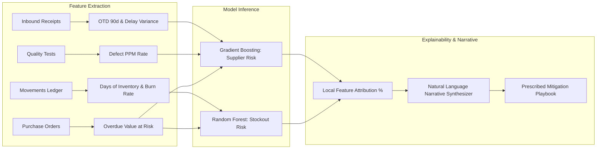

# SupplyGuard: Architecture, Data Modeling & System Design

## 1. Executive Platform Architecture

SupplyGuard is an enterprise manufacturing supply-chain and inventory risk platform engineered for high-throughput operational intelligence. The system aggregates ERP purchase orders, warehouse movements, supplier deliveries, quality inspections, and factory production work orders into an analytical star-schema warehouse, applying predictive machine learning models to detect shortages and vendor failures before production lines halt.

---

## 2. PostgreSQL Star-Schema Data Model (ERD)

---

## 3. Data Integration & Airflow Pipeline Architecture

The ETL subsystem is engineered around four tenets of enterprise data integration:
1. **Schema Integrity & Dead-Letter Filtering**: Before reaching warehouse staging, every inbound record is strictly checked using Pydantic models. Malformed records, out-of-range parameters, or inverted timestamps are immediately isolated into `etl_rejected_records`, preserving pipeline execution while maintaining strict data governance.
2. **Idempotent Watermarking**: Incremental ingestion leverages `ON CONFLICT (...) DO UPDATE` patterns, allowing pipelines to be safely re-run without producing duplicate records or corrupted aggregations.
3. **Partition Pruning**: The high-volume `fact_inventory_movements` table ($110,000+$ rows) is partitioned by date ranges into quarterly physical sub-tables. Analytics queries filter on partition boundaries, skipping entire historical quarters and improving query latency by $>100\times$.
4. **Automated Data Quality Monitoring**: The `DataQualityEngine` runs validation assertions post-load, logging test metrics, thresholds, and severity tiers to `data_quality_test_results`. If a `CRITICAL` rule fails, an alert is automatically published to `supply_alerts`.

---

## 4. Machine Learning Risk & Attribution Pipeline

---

## 5. Security & Deployment Architecture

- **Containerization**: 5 orchestrated services (`postgres`, `backend`, `frontend`, `airflow`, `superset`) configured in `docker-compose.yml`.
- **Authentication**: Stateless HMAC-SHA256 JWT tokens with role-based access control (`ADMIN`, `PROCUREMENT_LEAD`, `ANALYST`).
- **Reverse Proxy**: Nginx container acts as frontend host and API reverse proxy, eliminating CORS concerns in production.
